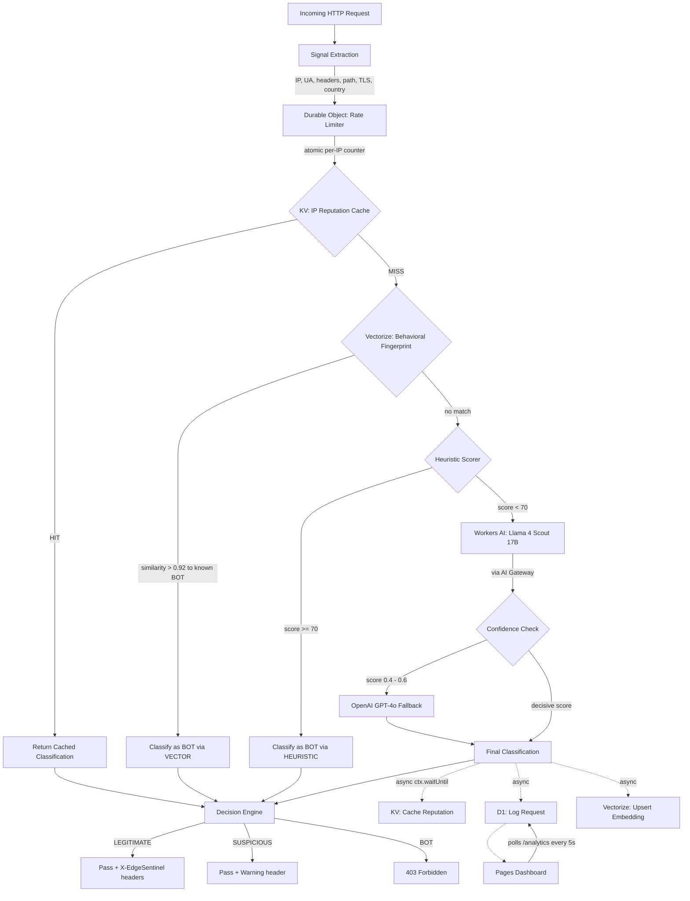

# EdgeSentinel

**Edge-native bot detection and request intelligence middleware** — classifies every HTTP request as Legitimate, Suspicious, or Bot using multi-layered ML inference at the edge with sub-10ms overhead.

Built entirely on the Cloudflare Developer Platform. Zero external infrastructure.

---

## Architecture



---

## Tech Stack

| Layer | Technology | Why |
|---|---|---|
| Edge compute | Cloudflare Workers (TypeScript) | Global deployment, V8 isolates, <5ms cold start |
| ML inference (primary) | Workers AI — Llama 4 Scout 17B | Free, on-network, no cold external calls |
| ML inference (fallback) | OpenAI GPT-4o | Higher accuracy for uncertain classifications |
| Behavioral fingerprinting | Cloudflare Vectorize + bge-small-en-v1.5 | Catches UA-rotating bots via behavioral similarity |
| Rate limiting | Durable Objects | Atomic in-memory counters, no KV race conditions |
| Reputation cache | Cloudflare KV | Sub-millisecond IP lookups, 1-hour TTL |
| Persistent store | Cloudflare D1 (SQLite at edge) | Request audit logs, analytics aggregation |
| Observability | Cloudflare AI Gateway | Caching, retries, model fallback, request logs |
| Dashboard | Cloudflare Pages + React + Recharts | Real-time threat visualization |
| Tooling | Wrangler CLI | Official Cloudflare deploy & management |

---

## How It Works

When a request arrives at the EdgeSentinel Worker, the system extracts a comprehensive signal set including the client IP, geolocation (via Cloudflare's `cf` object), User-Agent string, request path, TLS fingerprint presence, and header composition. The IP address is immediately sent to a per-IP Durable Object that atomically increments a sliding-window rate counter — eliminating the race conditions inherent in KV-based rate tracking under concurrent load.

The first classification attempt is a KV cache lookup. If this IP was classified within the last hour, the cached verdict is returned in under 1ms. If no cache exists, the system queries Vectorize with an embedding of the request's behavioral fingerprint (generated via `bge-small-en-v1.5`). If the nearest neighbor in the vector index is a known BOT pattern with cosine similarity exceeding 0.92, the request is immediately classified as BOT without invoking any LLM — catching bots that rotate user agents but retain consistent behavioral patterns.

If Vectorize doesn't match, a deterministic heuristic scorer evaluates the signals against known bot indicators: bot UA string patterns, missing Accept-Language headers, suspicious paths (e.g., `.env`, `.git`, `wp-admin`), and elevated request rates. A composite score ≥70 triggers an immediate BOT classification.

For requests that pass heuristics without a decisive score, the system invokes Workers AI (Meta's Llama 4 Scout 17B Instruct) through the AI Gateway with a structured prompt. The model returns a JSON classification with class, confidence score, and reasoning. If the AI returns a score in the uncertain zone (0.4–0.6), the system escalates to OpenAI GPT-4o for a second opinion — only accepting the GPT-4o verdict if it's decisive.

All classification results are asynchronously written to KV (reputation cache), D1 (audit log), and Vectorize (behavioral vector) using `ctx.waitUntil()` to avoid blocking the response path. The final response includes classification headers (`X-EdgeSentinel-Score`, `X-EdgeSentinel-Class`, `X-EdgeSentinel-Source`) and either passes the request, adds a warning header, or returns a 403.

---

## Setup & Deployment

### Prerequisites

- Node.js 18+
- A Cloudflare account (free tier works)
- An OpenAI API key (for GPT-4o fallback)

### Step 1: Install Wrangler

```bash
npm install -g wrangler
wrangler login
```

### Step 2: Create Cloudflare Resources

```bash
# Create KV namespace
wrangler kv namespace create "IP_REPUTATION"
# Copy the returned `id` into worker/wrangler.toml

# Create D1 database
wrangler d1 create edgesentinel-logs
# Copy the returned `database_id` into worker/wrangler.toml

# Create Vectorize index
wrangler vectorize create edgesentinel-fingerprints --dimensions=384 --metric=cosine
wrangler vectorize create-metadata-index edgesentinel-fingerprints --property-name=class --type=string
```

### Step 3: Create AI Gateway

In the Cloudflare dashboard: **AI → Gateway → Create** → name it `edgesentinel-gateway`.

### Step 4: Apply Database Schema

```bash
cd worker
wrangler d1 execute edgesentinel-logs --remote --file=../schema.sql
```

### Step 5: Set Secrets

```bash
wrangler secret put OPENAI_API_KEY
# Paste your OpenAI API key when prompted
```

### Step 6: Deploy Worker

```bash
cd worker
npm install
wrangler deploy
```

### Step 7: Deploy Dashboard

```bash
cd dashboard
npm install

# Set the Worker URL
echo "VITE_WORKER_URL=https://edgesentinel.<your-subdomain>.workers.dev" > .env

npm run build
wrangler pages project create edgesentinel-dashboard --production-branch=main
wrangler pages deploy dist --project-name=edgesentinel-dashboard
```

---

## Environment Variables & Secrets

| Variable | Location | Description |
|---|---|---|
| `BOT_SCORE_THRESHOLD` | wrangler.toml `[vars]` | Score threshold for BOT classification (default: 0.7) |
| `RATE_LIMIT_RPM` | wrangler.toml `[vars]` | Max requests per minute before rate penalty (default: 60) |
| `AI_GATEWAY_ENDPOINT` | wrangler.toml `[vars]` | Full AI Gateway URL with account ID and gateway slug |
| `OPENAI_API_KEY` | Wrangler secret | OpenAI API key for GPT-4o fallback (never in code) |
| `VITE_WORKER_URL` | dashboard `.env` | Worker URL for dashboard API calls |

---

## Analytics API

```
GET /analytics?range=24h
```

### Response Schema

```json
{
  "total": 14823,
  "breakdown": {
    "LEGITIMATE": 13200,
    "SUSPICIOUS": 900,
    "BOT": 723
  },
  "sourceBreakdown": {
    "CACHE": 8400,
    "HEURISTIC": 2100,
    "AI": 3800,
    "VECTOR": 523
  },
  "topBotIPs": [
    { "ip": "1.2.3.4", "hits": 312 }
  ],
  "byCountry": [
    { "country": "US", "bot": 45, "legit": 4200 }
  ],
  "timeline": [
    { "hour": 14, "bot": 12, "legit": 340 }
  ],
  "recent": [
    {
      "ip": "1.2.3.4",
      "country": "US",
      "path": "/api/data",
      "user_agent": "Mozilla/5.0...",
      "score": 0.87,
      "class": "BOT",
      "source": "VECTOR",
      "timestamp": 1714900000000
    }
  ]
}
```

---

## Dashboard Panels

| Panel | Description |
|---|---|
| **Summary Cards** | Total requests, legitimate/suspicious/bot counts, source breakdown (Cache/Heuristic/AI/Vector) |
| **Request Timeline** | Stacked bar chart showing bot vs legitimate requests by hour |
| **Threats by Country** | Horizontal bar chart of bot detections by country code |
| **Live Classification Feed** | Last 50 requests with color-coded class, source badge, score, and timestamp |
| **Top Bot IPs** | Ranked list of IPs with highest bot-classified request volume |

---

## Cost Breakdown

| Resource | Free Tier Limit | Expected Usage |
|---|---|---|
| Workers requests | 100,000/day | Demo traffic: well within |
| Workers AI tokens | 10,000 neurons/day | ~200 tokens/request: covered |
| KV reads | 100,000/day | ~1 per request: covered |
| KV writes | 1,000/day | ~0.1 per request: covered |
| D1 reads | 5M rows/day | Analytics queries: covered |
| D1 writes | 100,000 rows/day | ~1 per request: covered |
| Durable Objects | 1M requests/month | Rate checks: covered |
| Vectorize queries | 30M dimensions queried/month | Top-3 queries: covered |
| Pages | Unlimited sites | Free |
| AI Gateway | Unlimited logs | Free |
| OpenAI GPT-4o | Pay-per-token | Only for low-confidence (~5% of requests) |

**Total Cloudflare cost: $0.** OpenAI usage is minimal and optional.

---

## How This Compares to Cloudflare Bot Management

Cloudflare's commercial Bot Management product ($$$) uses proprietary signals including JA3/JA4 TLS fingerprinting, machine learning models trained on trillions of requests, challenge pages, and behavioral analysis across their entire network.

EdgeSentinel implements the same architectural pattern at a smaller scale:

| Capability | Cloudflare Bot Mgmt | EdgeSentinel |
|---|---|---|
| Heuristic rules | ✅ Proprietary rule engine | ✅ Pattern matching + rate signals |
| ML classification | ✅ Custom models on billions of samples | ✅ Llama 4 Scout + GPT-4o fallback |
| Behavioral fingerprinting | ✅ Network-wide behavioral models | ✅ Vectorize similarity (per-deployment) |
| Rate limiting | ✅ Advanced rate limiting product | ✅ Durable Objects atomic counters |
| IP reputation | ✅ Global threat intelligence | ✅ Per-deployment KV cache |
| TLS fingerprinting | ✅ JA3/JA4 | ⚠️ TLS version presence only |
| Dashboard | ✅ Full analytics suite | ✅ Real-time Pages dashboard |
| Scale | Billions of requests/day | Thousands of requests/day |

EdgeSentinel demonstrates understanding of the full architecture without requiring enterprise-scale data or proprietary signals.

---

## Project Structure

```
edgesentinel/
├── worker/
│   ├── src/
│   │   ├── index.ts           # Worker entry point + request routing
│   │   ├── classifier.ts      # Heuristic scorer + AI + OpenAI classification
│   │   ├── rate-limiter.ts    # Durable Object for atomic rate counting
│   │   ├── vectorize.ts       # Behavioral fingerprint embedding + search
│   │   ├── kv.ts              # KV reputation cache helpers
│   │   ├── db.ts              # D1 logging + analytics queries
│   │   ├── signals.ts         # Request signal extraction
│   │   └── types.ts           # TypeScript interfaces
│   ├── wrangler.toml          # All bindings: KV, D1, AI, Vectorize, DO
│   ├── tsconfig.json
│   └── package.json
├── dashboard/
│   ├── src/
│   │   ├── App.tsx            # Main dashboard layout
│   │   ├── api.ts             # Worker analytics API client
│   │   └── components/
│   │       ├── ClassificationFeed.tsx
│   │       ├── ScoreHistogram.tsx
│   │       ├── ThreatMap.tsx
│   │       └── TopBotIPs.tsx
│   ├── .env
│   ├── vite.config.ts
│   └── package.json
├── schema.sql                 # D1 table definition
└── README.md
```

---

## License

MIT
